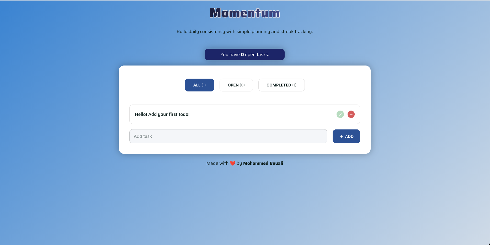

# Momentum Todo List

A minimal **Todo app** built with React. It supports creating, toggling, and deleting tasks.

---

## Demo

Live demo: https://momentum-todo-list.netlify.app/

## Screenshot

[](https://momentum-todo-list.netlify.app/)

---

## Features

- Add and delete todos
- Mark todos as completed
- Responsive layout and basic styling

---

## Tech Stack

- React 
- CSS

---

## Run locally

```bash
# clone the repo
git clone git@github.com:MedBouali/todo-list-react.git
cd todo-list-react

# install dependencies
npm install

# run the project
npm run dev